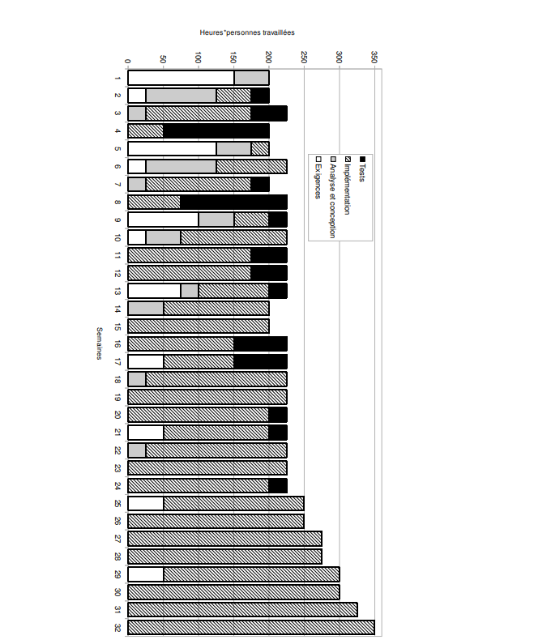

# Pre-CQI - Software Engineering

## Question 4 - Quantitative process analysis (3 points)

You are the manager of a maintenance team for a large organization. Other teams are responsible for developing the organization's software. The responsibility of your team is limited to the maintenance of the developed software. One of the development teams has just delivered new software, and you now find yourself responsible for maintenance. You have, however, heard about the difficulties encountered during the development of this software, which makes you suspect that it will be a challenge for your maintenance team.

You manage to get your hands on software development process data. This software was developed in 32 weeks by a team of six people. These six people were working full-time on this project, which means working hours of 37.5 hours per person per week, or 225 hours * people per week for the entire team.

The figure below presents the detail of the effort spent on the project, according to the four main disciplines of software development.

Now:
a) Based on the Figure, describe the life cycle used for the development of this new software.

b) Based on the lifecycle and data in the Figure, describe potential issues that this new software might have that might concern maintenance.

c) As the manager of the maintenance team, and based on the problems described above, what would you do to mitigate the maintenance challenges brought by this new
software ?